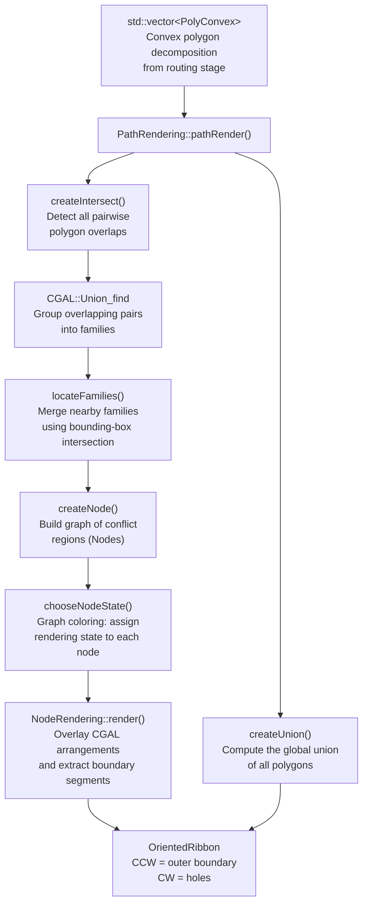
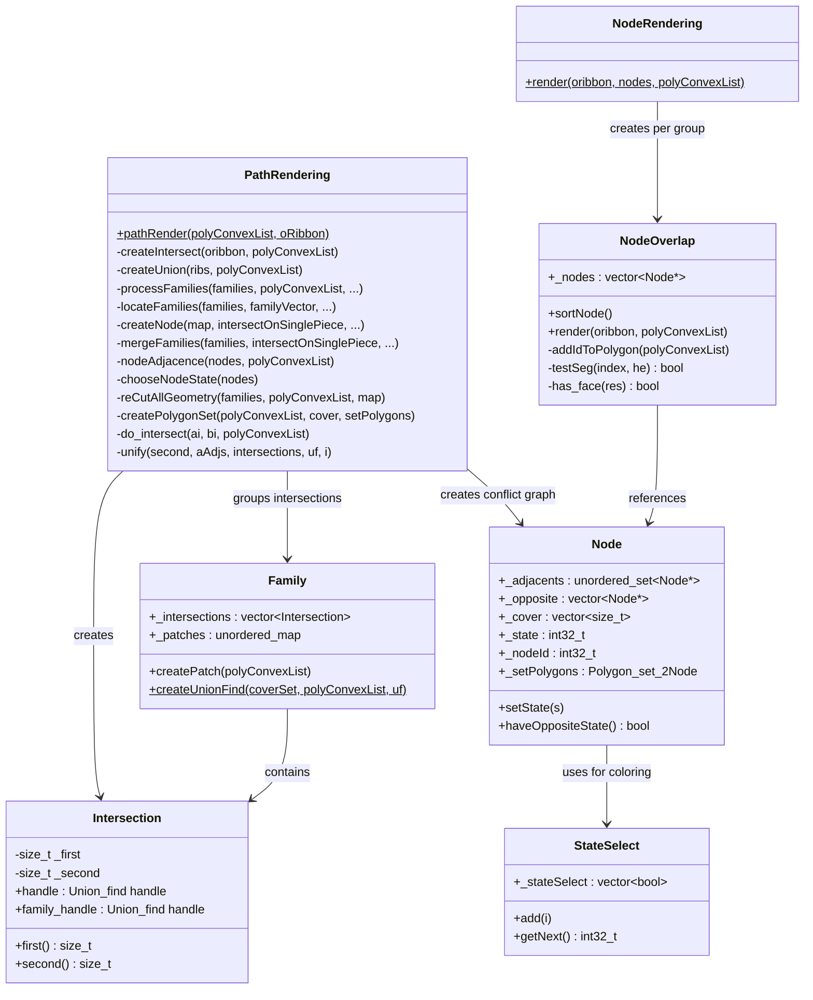
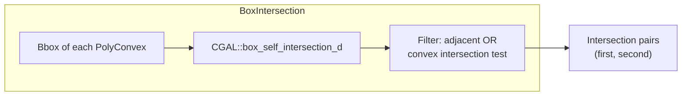
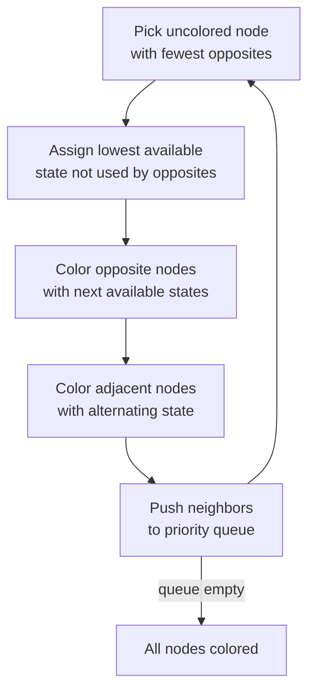

# flatteningOverlap – Overlap Resolution Module

This module resolves overlapping convex polygons (from the routing stage) into a clean, non-overlapping boundary representation suitable for pen-stroke rendering.

## Purpose

When multiple routed paths cross the same region, their convex polygon decompositions overlap. The `flatteningOverlap` module detects these overlaps, groups them into families, assigns rendering states to avoid visual conflicts, and outputs a merged boundary as oriented segments (CW/CCW).

## Architecture

## Class Diagram

## Algorithm Detail

### Step 1 – Detect Intersections

`createIntersect()` uses CGAL box intersection (`box_self_intersection_d`) to efficiently find all pairs of overlapping convex polygons. Adjacent polygons (sharing an edge) are included directly; non-adjacent pairs are tested with `PolyConvex::testConvexPolyIntersect`.

### Step 2 – Group into Families (Union-Find)

Overlapping pairs that share a polygon index are merged into **families** using `CGAL::Union_find`. Each family represents a cluster of mutually-related overlap pairs.

### Step 3 – Create Patches

Each `Family` calls `createPatch()` to split its polygon indices into connected components (**patches**) via Union-Find on the adjacency graph. A family with 2 patches has a clean two-sided overlap; families with 1 patch have single-piece overlaps that need special handling.

### Step 4 – Locate Families (Spatial Merge)

`locateFamilies()` uses a second round of `box_self_intersection_d` on the intersection bounding boxes to detect families that overlap geometrically. Overlapping families are merged using another Union-Find.

### Step 5 – Build Conflict Graph (Nodes)

`createNode()` creates `Node` objects for each connected component in the merged family groups. Nodes that share polygon coverage are connected as **opposites** (conflicting), and nodes from adjacent regions are connected as **adjacents**.

### Step 6 – Graph Coloring (State Assignment)

`chooseNodeState()` assigns rendering states (0, 1, 2, …) using a greedy priority-queue approach:
- Opposite nodes must have different states
- Adjacent nodes prefer alternating states (0 ↔ 1)
- The priority queue processes nodes with fewer opposite connections first

### Step 7 – Arrangement Overlay and Boundary Extraction

`NodeRendering::render()` overlays the CGAL polygon arrangements of opposite nodes to find shared boundaries:
- If no face has multiple polygon IDs → extract **edge** boundaries between different polygons
- If faces have multiple polygon IDs → extract the **face outer boundary** (CCW) and **hole boundaries** (CW) for the winning polygon (minimum state index)

### Step 8 – Global Union

`createUnion()` computes the union of all input polygons and adds the outer boundary (CCW) and holes (CW) to the `OrientedRibbon`.

## Data Flow Summary

| Stage | Input | Output | CGAL Feature |
|-------|-------|--------|-------------|
| Box intersection | Bounding boxes | Overlap pairs | `box_self_intersection_d` |
| Union-Find grouping | Overlap pairs | Families | `Union_find` |
| Patch creation | Family + adjacency | Connected components | `Union_find` |
| Family merging | Family bounding boxes | Merged groups | `box_self_intersection_d` |
| Polygon set creation | Convex polygons | Arrangement | `General_polygon_set_2` |
| Arrangement overlay | Node arrangements | Merged arrangement | `overlay()` |
| Boundary extraction | Face/edge data | Oriented segments | Arrangement traversal |
| Global union | All polygons | Outer boundary | `Polygon_set_2` |
