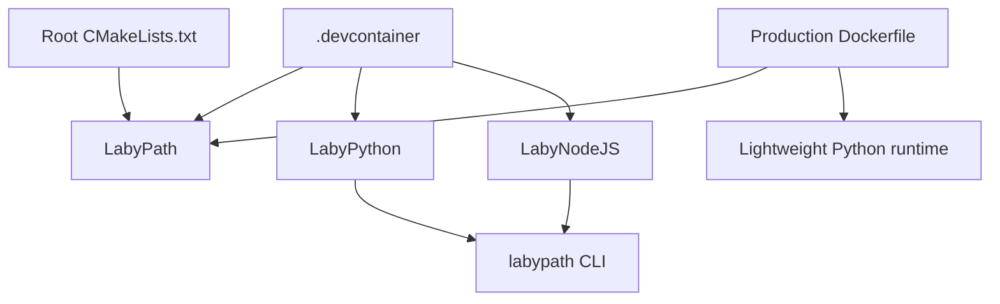

# LabyPath Workspace

This repository combines the native routing engine with two orchestration layers around the same labyrinth-routing pipeline:

- `LabyPath/`: the C++ geometry and routing engine, built as the `labypath` CLI.
- `LabyPython/`: the PyQt desktop application that prepares projects, launches the CLI, and manages outputs.
- `LabyNodeJS/`: the TypeScript orchestration package that shells out to the CLI and memoizes repeated jobs.

The root workspace is mainly an integration layer. The top-level CMake project delegates to `LabyPath`, the devcontainer provisions the full C++/Python/Node toolchain, and the production Docker image currently packages the CLI-focused runtime rather than the orchestration tooling.

## Repository Map

| Area | Role | Main entry points |
| --- | --- | --- |
| `LabyPath/` | Core geometry, routing, rendering, protobuf schema, C++ tests | `src/Main.cpp`, `src/MessageIO.cpp`, `API/AllConfig.proto` |
| `LabyPython/` | Desktop GUI and project orchestration | `src/LabyPython/App.py` |
| `LabyNodeJS/` | TypeScript stage orchestration and cache layer | `src/index.ts`, `src/runner.ts`, `src/cache.ts` |
| `.devcontainer/` | Development container with compilers, Python, Qt, and Node 24 | `.devcontainer/Dockerfile`, `.devcontainer/devcontainer.json` |
| `Dockerfile` | CLI-oriented production/runtime image | `/workspace/Dockerfile` |

## Module Dependencies



Important boundary conditions:

- The root CMake project only builds `LabyPath`; it does not compile `LabyPython` or `LabyNodeJS`.
- `LabyNodeJS` does not link to the C++ engine directly. It writes stage-specific config files and launches the `labypath` executable as an external process.
- The current production Docker image does not include the LabyNodeJS package and does not install PyQt6. It packages the CLI plus a small Python environment used for automation and tests.

## Processing Pipeline

The canonical configuration schema lives in [LabyPath/API/AllConfig.proto](LabyPath/API/AllConfig.proto). At runtime, [LabyPath/src/MessageIO.cpp](LabyPath/src/MessageIO.cpp) dispatches the enabled sections independently:

1. `skeletonGrid`
2. `routing.placement`
3. `routing.alternateRouting`
4. `gGraphicRendering`

That ordering matters for the documentation because routing is not a single monolithic stage. `Placement` and `AlternateRouting` are distinct optional passes under the `routing` message. If both are enabled, both can run.

At a high level:

- Grid generation derives a navigable structure from the geometric input.
- Placement routing runs a cost-driven best-first search over the prepared arrangement.
- Alternate routing builds route strips from Voronoi structure, offsets, and trapezoids over the same grid-coded input.
- Graphic rendering covers both overlap-aware ribbon output and the standalone pen-stroke render stage.

More detail is in [docs/pipeline-and-algorithms.md](docs/pipeline-and-algorithms.md).

## Key Algorithms

The old short list in this README was too compressed. The codebase contains several families of algorithms rather than one single method:

- Skeleton and grid construction: geometric preprocessing, offsetting, radial analysis, and grid indexing build the search space used by later stages.
- Route placement: cost-driven graph exploration on the generated structure chooses corridor paths under width, spacing, and attempt-count constraints.
- Alternate routing: an optional follow-up pass can explore different route layouts using a separate parameter block.
- Rendering and post-processing: ribbons, polylines, convex handling, and SVG-oriented geometry conversion turn routed data into final drawings.

The deeper explanation, including why the routing step is better described as weighted graph search than as textbook A*, is in [docs/pipeline-and-algorithms.md](docs/pipeline-and-algorithms.md).

## Build Layouts

There are two valid build layouts in this repository, and the documentation needs to treat them separately:

- Root workspace layout: the top-level CMake wrapper configures into `.cmake/build` and adds `LabyPath` as a subdirectory. The workspace tasks and VS Code settings use this path.
- Direct `LabyPath` layout: the devcontainer CMake Tools configuration points directly at `LabyPath` with `LabyPath/build` as the build directory.

Both are intentional. The first is convenient for workspace-level tasks; the second is convenient when treating `LabyPath` as the active CMake project.

## Development Environments

### Devcontainer

The devcontainer is the main development environment. It installs the native toolchain, Python tooling, Qt dependencies, and Node.js 24 directly in the container image. The checked-in `downloads/nodejs-v24` bundle is no longer the intended developer path.

### Production Docker Image

The root [Dockerfile](Dockerfile) currently builds and packages:

- the `labypath` binary
- a minimal Python virtual environment for non-GUI tooling
- input/config assets needed by the runtime layout

It does not currently package:

- the LabyNodeJS package
- a Node.js runtime
- the PyQt desktop GUI stack

That is why Node 24 is required in the devcontainer today but is not yet required by the production image.

## Running The Applications

### LabyPath

Use the workspace CMake tasks or configure/build manually through the root wrapper or directly in `LabyPath`.

### LabyPython

The desktop application lives in [LabyPython/src/LabyPython/App.py](LabyPython/src/LabyPython/App.py). It prepares project state, locates the `labypath` executable, launches processing jobs, and manages logs and generated files.

### LabyNodeJS

LabyNodeJS is a standalone TypeScript package. The quickest local start is:

```bash
cd /workspace/LabyNodeJS
npm install
npm run build
npm test
```

For a direct experiment runner, use `npm run example`. Additional details are in [LabyNodeJS/README.md](LabyNodeJS/README.md).

## Documentation Map

- [docs/README.md](docs/README.md): entry point for the technical docs set.
- [docs/repo-architecture.md](docs/repo-architecture.md): component boundaries, runtime responsibilities, and build/container layout.
- [docs/pipeline-and-algorithms.md](docs/pipeline-and-algorithms.md): stage-by-stage processing and algorithm notes.
- [docs/configuration-and-workflows.md](docs/configuration-and-workflows.md): config schema crosswalk and how LabyPython/LabyNodeJS drive the CLI.
- [docs/labynodejs-config-and-cache.md](docs/labynodejs-config-and-cache.md): stage payload mapping, cache keys, and manifest layout for LabyNodeJS.
- [docs/field-generators-and-noise.md](docs/field-generators-and-noise.md): `StreamLine`, `HqNoise`, and the experimental field-generator path.
- [LabyNodeJS/README.md](LabyNodeJS/README.md): TypeScript orchestration usage and developer workflow.
- [LabyPath/src/flatteningOverlap/README.md](LabyPath/src/flatteningOverlap/README.md): focused notes for the flattening-overlap area.
- [LabyPath/src/flatteningOverlap/VISUAL_EXAMPLES.md](LabyPath/src/flatteningOverlap/VISUAL_EXAMPLES.md): visual examples for that subsystem.

## Tests

The workspace includes separate C++ and Python test entry points. In VS Code, use the provided tasks:

- `Run C++ Tests`
- `Run Python Tests`
- `Run All Tests`

`LabyPath/CMakeLists.txt` currently registers a substantial C++ test suite, while the Python side has its own pytest-based coverage under `LabyPython/tests/`.

## Dependencies

The documented hard C++ requirements should match [LabyPath/CMakeLists.txt](LabyPath/CMakeLists.txt):

- C++20 compiler
- CGAL `6.1.1` or newer
- Protobuf `34.1.0` or newer

The build also fetches or vendors additional libraries such as SVG++ and Microsoft GSL. JavaScript and Python dependencies are managed separately inside `LabyNodeJS/` and `LabyPython/`.