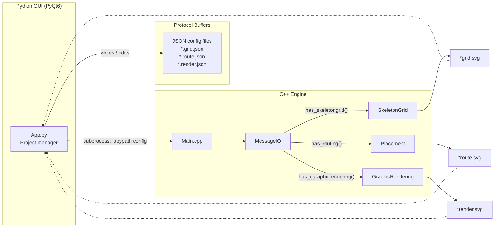
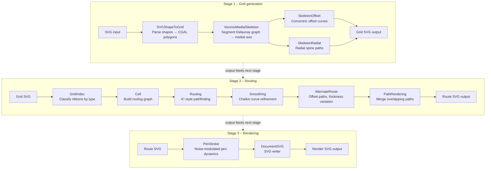
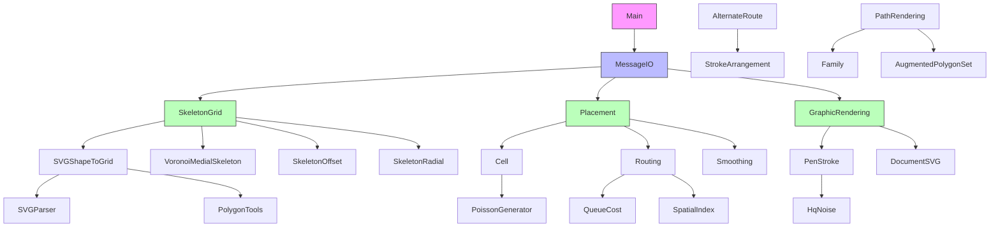

# LabyPath

A path/maze generation and rendering system using [CGAL](https://www.cgal.org/) for computational geometry.

LabyPath generates labyrinth-style artwork from SVG shapes using Voronoi diagrams, medial axis computation, polygon offsetting, anisotropic routing, and pen-stroke rendering.

## Architecture overview

The system has three main components: a **Python GUI** (PyQt6) for project management, a **Protobuf** schema for configuration, and a **C++ engine** for geometry processing.



### Processing pipeline

The C++ engine implements a three-stage pipeline. Each stage is independently triggered by its presence in the JSON config:



### Key algorithms

| Module | Algorithm | Description |
|--------|-----------|-------------|
| `VoronoiMedialSkeleton` | Segment Delaunay Graph | Computes the medial axis of polygonal regions |
| `SkeletonOffset` | Perpendicular offsetting | Generates concentric offset curves along edges |
| `SkeletonRadial` | Ray tracing through faces | Shoots perpendicular rays to create radial paths |
| `Routing` | Weighted A\* search | Pathfinding with congestion, via, and distance costs |
| `AlternateRoute` | Arrangement offsetting | Generates alternative paths at varying thickness |
| `PenStroke` | FFT noise modulation | Simulates hand-drawn strokes with frequency-controlled noise |
| `PoissonGenerator` | Bridson's algorithm | Fast Poisson disk sampling for natural point distributions |
| `HqNoise` | FFT spectral shaping | Generates colored noise with power-law and Gaussian filters |
| `Smoothing` | Chaikin subdivision | Iterative curve smoothing with tension control |
| `SimplifyLines` | Douglas-Peucker | Line decimation via Boost.Geometry |

### Module dependency graph



## Features

- **SVG parsing and output** – Import shapes from SVG files and export rendered results.
- **Skeleton grid generation** – Compute medial axes and Voronoi skeletons from polygonal regions.
- **Anisotropic routing** – Place and route paths with configurable cost functions.
- **Pen-stroke rendering** – Emulate hand-drawn line art with configurable pen dynamics.
- **Noise generation** – Poisson disk sampling and HQ noise for natural-looking distributions.

## Dependencies

| Library | Minimum version | Purpose |
|---------|----------------|---------|
| **CGAL** | 5.6+ | Computational geometry (arrangements, Voronoi, polygon ops) |
| **Boost** | 1.74+ | Multi-array, geometry utilities |
| **Protobuf** | 3.21+ | Configuration message serialization |
| **FFTW3** | 3.3+ | FFT for noise generation (optional) |
| **SVG++** | 1.3+ | SVG parsing library |
| **MS GSL** | 4.0+ | Microsoft Guidelines Support Library |
| **GTest** | 1.14+ | Unit testing framework |
| **CMake** | 3.20+ | Build system |

## Building

### Prerequisites (Ubuntu 24.04)

```bash
sudo apt-get install -y \
    g++-14 cmake ninja-build \
    libcgal-dev libgmp-dev libmpfr-dev \
    libboost-all-dev \
    libprotobuf-dev protobuf-compiler \
    libfftw3-dev \
    libsvgpp-dev libmsgsl-dev \
    libgtest-dev
```

### Build with CMake

```bash
cmake -S . -B .cmake/build -G Ninja \
    -DCMAKE_BUILD_TYPE=Release \
    -DCMAKE_CXX_COMPILER=g++-14 \
    -DLABYPATH_BUILD_TESTS=ON \
    -DCMAKE_EXPORT_COMPILE_COMMANDS=ON
cmake --build .cmake/build --parallel $(nproc)
```

### Run tests

```bash
ctest --test-dir .cmake/build --output-on-failure
```

### Build options

| Option | Default | Description |
|--------|---------|-------------|
| `LABYPATH_BUILD_TESTS` | `ON` | Build unit tests |
| `LABYPATH_WERROR` | `OFF` | Treat compiler warnings as errors |
| `LABYPATH_ENABLE_PROFILER` | `OFF` | Enable easy_profiler integration |

## Development with VS Code (recommended)

The project includes a complete **Dev Container** setup so all compilation, testing, debugging, and even the Python GUI run inside a Docker container — no local toolchain installation required.

### Quick start

1. Install [VS Code](https://code.visualstudio.com/) and the **Dev Containers** extension.
2. Open this repository in VS Code.
3. When prompted, click **"Reopen in Container"** (or run `Dev Containers: Reopen in Container` from the command palette).
4. The container builds automatically with GCC 14, CMake, CGAL, FFTW3, GDB, clang-tidy, Python 3, PyQt6.
5. VS Code and CMake Tools use the repository root as the CMake source directory and write all generated files to `.cmake/build`.

### Build and test (inside the container)

| Task | Keyboard shortcut | Description |
|------|-------------------|-------------|
| **Build C++** | `Ctrl+Shift+B` | Configures the root CMake workspace and builds `.cmake/build` with Ninja |
| **Run C++ Tests** | `Ctrl+Shift+T` → select "Run C++ Tests" | Runs the Google Test suite from `.cmake/build` via ctest |
| **Run Python Tests** | `Ctrl+Shift+T` → select "Run Python Tests" | Runs pytest on LabyPython/tests/ |
| **Run All Tests** | `Ctrl+Shift+T` → select "Run All Tests" | Runs C++ then Python tests sequentially |
| **Launch Python GUI** | `Ctrl+Shift+T` → select "Launch Python GUI" | Starts the PyQt6 GUI (requires X11 forwarding) |

The `.cmake/` directory is generated build output for the workspace-level wrapper `CMakeLists.txt`. The actual C++ binaries live under `.cmake/build/LabyPath/`.

### Debugging (inside the container)

| Configuration | Description |
|---------------|-------------|
| **Debug C++ Tests** | Run all Google Tests under GDB with pretty-printing |
| **Debug Single C++ Test** | Run a single test by name (`--gtest_filter=TestName.*`) |
| **Debug C++ (labypath)** | Debug the main executable with a config file |
| **Debug Python GUI** | Debug the PyQt6 GUI with debugpy |
| **Debug Python Tests** | Debug pytest with debugpy |

The container has `SYS_PTRACE` capability for GDB and `seccomp:unconfined` for valgrind.

### Python GUI with X11 forwarding

To run the PyQt6 GUI from inside the container, X11 forwarding must be enabled:

**Linux:**
```bash
xhost +local:docker   # Allow local Docker containers to access X
```
Then reopen in container — the GUI will display on your host screen.

**macOS (via XQuartz):**
```bash
brew install --cask xquartz
open -a XQuartz       # Enable "Allow connections from network clients" in Preferences
xhost +localhost
export DISPLAY=host.docker.internal:0
```

**Windows (via VcXsrv):**
1. Install [VcXsrv](https://sourceforge.net/projects/vcxsrv/).
2. Launch with "Disable access control" checked.
3. Set `DISPLAY=host.docker.internal:0` in `.devcontainer/docker-compose.yml`.

### Project configuration files

| File | Purpose |
|------|---------|
| `.devcontainer/devcontainer.json` | Dev Container configuration |
| `.devcontainer/Dockerfile` | Development Docker image (debug tools, X11, Python venv) |
| `.devcontainer/docker-compose.yml` | Container orchestration with X11 volumes |
| `.vscode/settings.json` | CMake, C++, Python, editor settings |
| `.vscode/tasks.json` | Build, test, lint, format tasks |
| `.vscode/launch.json` | Debug configurations (GDB, debugpy) |
| `.vscode/extensions.json` | Recommended extensions |

## Docker (production)

Build and run the production image (Ubuntu 24.04 + GCC 14):

```bash
docker build -t labypath .
docker run --rm labypath <config.json>
```

The production Docker image:
1. Builds the C++ project and runs the full Google Test suite
2. Installs Python dependencies and runs Python tests (protobuf + watcher tests)
3. Produces a minimal runtime image with the C++ binary and the Python GUI

Note: The GUI tests that require a display (PyQt6) are skipped in the Docker build since there is no X server available.
To run the GUI in Docker, use the dev container setup described above.

## Python GUI

The `LabyPython/` directory contains a PyQt6 project-management GUI. It lets you:

1. Import original SVG files.
2. Create / edit JSON configuration files for each pipeline stage.
3. Launch the C++ engine on selected configs.
4. Open generated SVG results in Inkscape.

### Python prerequisites

```bash
cd LabyPython
pip install -r requirements.txt   # PyQt6, protobuf, watchdog
```

### Run the GUI

```bash
cd LabyPython/src
python -m LabyPython.App
```

### Run Python tests

```bash
cd LabyPython
python -m pytest tests/ -v
```

## Usage

LabyPath reads a JSON configuration file (see `config.json` for an example):

```bash
./.cmake/build/LabyPath/labypath LabyPath/config.json
```

The configuration is defined by Protocol Buffer messages in `API/AllConfig.proto`.

## Project structure

```
.
├── CMakeLists.txt            # Workspace wrapper CMake entrypoint for VS Code / CMake Tools
├── .cmake/                   # Generated build output (created after configure)
├── .devcontainer/
├── .vscode/
├── Dockerfile
├── README.md
├── LabyPath/
│   ├── CMakeLists.txt              # CMake build configuration
│   ├── .clang-format               # Code formatting configuration
│   ├── .clang-tidy                 # Linter configuration
│   ├── API/                        # Protobuf definitions
│   │   └── AllConfig.proto
│   ├── src/
│   │   ├── Main.cpp                # Entry point
│   │   ├── MessageIO.*             # JSON config parsing via Protobuf
│   │   ├── GeomData.*              # CGAL type definitions (Epeck kernel)
│   │   ├── SkeletonGrid.*          # Skeleton grid generation orchestrator
│   │   ├── VoronoiMedialSkeleton.* # Voronoi / medial axis computation
│   │   ├── SkeletonOffset.*        # Concentric offset curve generation
│   │   ├── SkeletonRadial.*        # Radial spine path generation
│   │   ├── SVGShapeToGrid.*        # SVG → CGAL polygon conversion
│   │   ├── Anisotrop/              # Anisotropic routing
│   │   │   ├── Cell.*              # Routing graph construction
│   │   │   ├── Routing.*           # A*-style pathfinding
│   │   │   ├── Placement.*         # Routing orchestrator
│   │   │   ├── QueueCost.*         # Priority-queue cost model
│   │   │   ├── QueueElement.*      # Priority-queue element
│   │   │   ├── Net.*               # Source–target pin pairs
│   │   │   └── SpatialIndex.*      # Spatial lookup structures
│   │   ├── AlternaRoute/           # Alternate routing with thickness
│   │   ├── Rendering/              # Pen-stroke rendering
│   │   │   ├── GraphicRendering.*  # SVG output orchestrator
│   │   │   └── PenStroke.*         # Noise-modulated pen dynamics
│   │   ├── SVGParser/              # SVG input parsing (svgpp-based)
│   │   ├── SVGWriter/              # SVG output generation
│   │   ├── basic/                  # Utility classes
│   │   │   ├── Color.*             # RGB color packing
│   │   │   ├── CircleIntersection.* # Circle–line intersection
│   │   │   ├── LinearGradient.*    # Thickness interpolation
│   │   │   ├── NumericRange.*      # Numeric range iteration
│   │   │   ├── PairInteger.*       # Ordered int-pair with hashing
│   │   │   ├── PolygonTools.*      # Trapeze creation, polygon ops
│   │   │   ├── RandomInteger.*     # Seeded integer RNG
│   │   │   ├── RandomUniDist.*     # Seeded uniform-real RNG
│   │   │   └── SimplifyLines.*     # Douglas-Peucker decimation
│   │   ├── generator/              # Noise and point generators
│   │   │   ├── HqNoise.*           # FFT spectral noise
│   │   │   ├── FftwArray.h         # FFTW3-backed array wrappers
│   │   │   ├── PoissonGenerator.h  # Poisson disk sampling
│   │   │   └── StreamLine.*        # Stream-line field tracing
│   │   ├── flatteningOverlap/      # Overlap resolution & path merging (see [README](LabyPath/src/flatteningOverlap/README.md) and [visual examples](LabyPath/src/flatteningOverlap/VISUAL_EXAMPLES.md))
│   │   ├── agg/                    # Anti-aliased graphics primitives
│   │   └── protoc/                 # Generated Protobuf code
│   ├── tests/                      # Google Test unit tests (28 files, ~300 tests)
│   ├── config.json                 # Example noise configuration
│   └── config.txt                  # Example protobuf-text configuration
└── LabyPython/
    ├── Pipfile                     # Python dependency spec
    ├── requirements.txt            # pip requirements
    ├── MazeCreator.ui              # Qt Designer UI file
    ├── src/LabyPython/
    │   ├── App.py                  # Main GUI application (PyQt6)
    │   ├── mazeCreator.py          # Generated UI code (pyuic6)
    │   ├── AllConfig_pb2.py        # Generated Protobuf bindings
    │   └── watchAndLaunch.py       # Background worker queue
    └── tests/                      # Python unit tests (pytest)
```

## Test coverage

### C++ tests (~300 tests across 28 test files)

| Test file | Module(s) tested | Tests |
|-----------|-----------------|-------|
| `test_polyline` | Polyline | 8 |
| `test_edgeinfo` | GeomData (EdgeInfo) | 9 |
| `test_vertexinfo` | GeomData (VertexInfo) | 6 |
| `test_ribbon` | Ribbon | 9 |
| `test_geomdata` | GeomData, Arrangement | 8 |
| `test_smoothing` | Smoothing (Chaikin) | 9 |
| `test_color` | Color (RGB packing) | 12 |
| `test_pairinteger` | PairInteger | 10 |
| `test_numericrange` | NumericRange, NumericHelper | 7 |
| `test_lineargradient` | LinearGradient | 8 |
| `test_circleintersection` | CircleIntersection | 4 |
| `test_polygontools` | PolygonTools | 8 |
| `test_orientedribbon` | OrientedRibbon | 6 |
| `test_segmentps` | SegmentPS | 2 |
| `test_queuecost` | QueueCost (routing priority) | 9 |
| `test_randominteger` | RandomInteger | 7 |
| `test_randomunidist` | RandomUniDist | 8 |
| `test_hqnoiseutils` | HqNoiseUtils, sgn functions | 18 |
| `test_simplifylines` | SimplifyLines (decimation) | 5 |
| `test_poissongenerator` | PoissonGenerator (sPoint, sGrid) | 14 |
| `test_flatteningoverlap` | Intersection, Node, StateSelect, NodeQueue, Family | 21 |
| `test_smoke_svg` | SVG Loader, SkeletonGrid, GraphicRendering, AlternateRoute | 20 |
| `test_polyconvex` | PolyConvex construction, adjacency, intersection, reset | 13 |
| `test_graph_coloring` | Graph coloring, StateSelect, NodeOverlap sort, Family | 9 |
| `test_iterators` | NumericRange, RangeHelper, NodeQueue iterators | 20 |
| `test_net` | Pin, Net (routing network) | 13 |
| `test_queueelement` | QueueElement (routing priority queue) | 8 |
| `test_documentsvg` | DocumentSVG, Layout, Color, shapes, coordinate transforms | 30 |

**Coverage summary:** 28 of 54 functional source modules have unit tests (~52%).
The `test_smoke_svg` qualification tests validate end-to-end geometric correctness:
coordinates within viewBox, finite values, polyline integrity, output SVG structure,
and skeleton bounds matching input bounds.
Untested modules are primarily the CGAL-heavy processing stages (VoronoiMedialSkeleton, SkeletonOffset, SkeletonRadial, SVGParser, Routing) which require complex geometric setup.
The `flatteningOverlap` module has detailed documentation with mermaid diagrams in [`LabyPath/src/flatteningOverlap/README.md`](LabyPath/src/flatteningOverlap/README.md).

### Python tests (34 tests across 3 test files)

| Test file | Module(s) tested |
|-----------|-----------------|
| `test_protobuf_config` | AllConfig protobuf messages |
| `test_watcher` | watchAndLaunch worker queue |
| `test_gui_imports` | PyQt6 imports, Qt6 enum constants |

## Code style

- **C++17** standard
- Strict compiler warnings (`-Wall -Wextra -Wpedantic -Wshadow -Wconversion -Wsign-conversion -Wdouble-promotion` and more)
- **Zero warnings** from project source code (third-party headers suppressed via SYSTEM includes)
- Code formatting enforced by [clang-format](https://clang.llvm.org/docs/ClangFormat.html) (see `.clang-format`)
- Static analysis via [clang-tidy](https://clang.llvm.org/extra/clang-tidy/) (see `.clang-tidy`)
- All project code lives in the `laby` namespace

## License

See individual source file headers for authorship information.
