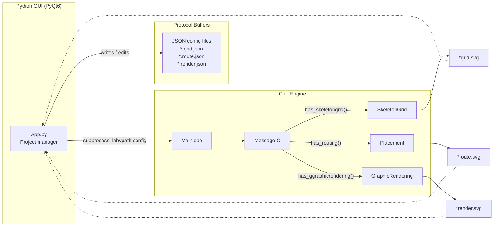
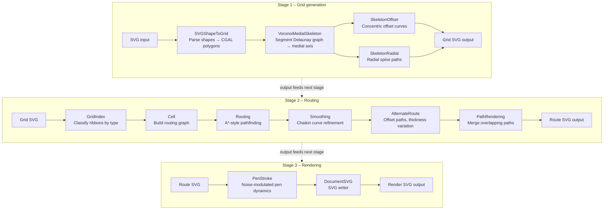
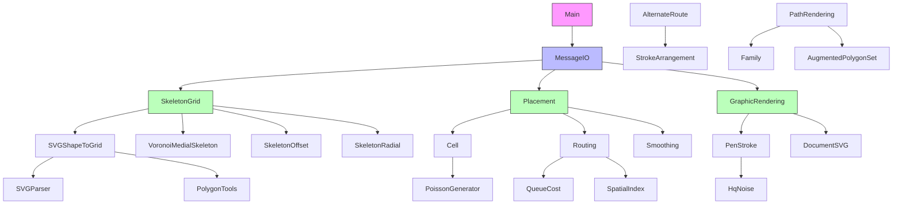

# LabyPath

A path/maze generation and rendering system using [CGAL](https://www.cgal.org/) for computational geometry.

LabyPath generates labyrinth-style artwork from SVG shapes using Voronoi diagrams, medial axis computation, polygon offsetting, anisotropic routing, and pen-stroke rendering.

## Architecture overview

The system has three main components: a **Python GUI** (PyQt6) for project management, a **Protobuf** schema for configuration, and a **C++ engine** for geometry processing.



### Processing pipeline

The C++ engine implements a three-stage pipeline. Each stage is independently triggered by its presence in the JSON config:



### Key algorithms

| Module | Algorithm | Description |
|--------|-----------|-------------|
| `VoronoiMedialSkeleton` | Segment Delaunay Graph | Computes the medial axis of polygonal regions |
| `SkeletonOffset` | Perpendicular offsetting | Generates concentric offset curves along edges |
| `SkeletonRadial` | Ray tracing through faces | Shoots perpendicular rays to create radial paths |
| `Routing` | Weighted A\* search | Pathfinding with congestion, via, and distance costs |
| `AlternateRoute` | Arrangement offsetting | Generates alternative paths at varying thickness |
| `PenStroke` | FFT noise modulation | Simulates hand-drawn strokes with frequency-controlled noise |
| `PoissonGenerator` | Bridson's algorithm | Fast Poisson disk sampling for natural point distributions |
| `HqNoise` | FFT spectral shaping | Generates colored noise with power-law and Gaussian filters |
| `Smoothing` | Chaikin subdivision | Iterative curve smoothing with tension control |
| `SimplifyLines` | Douglas-Peucker | Line decimation via Boost.Geometry |

### Module dependency graph



## Features

- **SVG parsing and output** – Import shapes from SVG files and export rendered results.
- **Skeleton grid generation** – Compute medial axes and Voronoi skeletons from polygonal regions.
- **Anisotropic routing** – Place and route paths with configurable cost functions.
- **Pen-stroke rendering** – Emulate hand-drawn line art with configurable pen dynamics.
- **Noise generation** – Poisson disk sampling and HQ noise for natural-looking distributions.

## Dependencies

| Library | Minimum version | Purpose |
|---------|----------------|---------|
| **CGAL** | 5.6+ | Computational geometry (arrangements, Voronoi, polygon ops) |
| **Boost** | 1.74+ | Multi-array, geometry utilities |
| **Protobuf** | 3.21+ | Configuration message serialization |
| **FFTW3** | 3.3+ | FFT for noise generation (optional) |
| **SVG++** | 1.3+ | SVG parsing library |
| **MS GSL** | 4.0+ | Microsoft Guidelines Support Library |
| **GTest** | 1.14+ | Unit testing framework |
| **CMake** | 3.20+ | Build system |

## Building

### Prerequisites (Ubuntu 24.04)

```bash
sudo apt-get install -y \
    g++-14 cmake ninja-build \
    libcgal-dev libgmp-dev libmpfr-dev \
    libboost-all-dev \
    libprotobuf-dev protobuf-compiler \
    libfftw3-dev \
    libsvgpp-dev libmsgsl-dev \
    libgtest-dev
```

### Build with CMake

```bash
cd LabyPath
cmake -B build -G Ninja \
    -DCMAKE_BUILD_TYPE=Release \
    -DCMAKE_CXX_COMPILER=g++-14
cmake --build build --parallel $(nproc)
```

### Run tests

```bash
cd LabyPath/build
ctest --output-on-failure
```

### Build options

| Option | Default | Description |
|--------|---------|-------------|
| `LABYPATH_BUILD_TESTS` | `ON` | Build unit tests |
| `LABYPATH_WERROR` | `OFF` | Treat compiler warnings as errors |
| `LABYPATH_ENABLE_PROFILER` | `OFF` | Enable easy\_profiler integration |

## Docker

Build and run using the provided Dockerfile (Ubuntu 24.04 + GCC 14):

```bash
docker build -t labypath .
docker run --rm labypath <config.json>
```

The Docker image installs all dependencies, builds the project, and runs the full test suite during the build step.

## Python GUI

The `LabyPython/` directory contains a PyQt6 project-management GUI. It lets you:

1. Import original SVG files.
2. Create / edit JSON configuration files for each pipeline stage.
3. Launch the C++ engine on selected configs.
4. Open generated SVG results in Inkscape.

### Python prerequisites

```bash
cd LabyPython
pip install -r requirements.txt   # PyQt6, protobuf, watchdog
```

### Run the GUI

```bash
cd LabyPython/src
python -m LabyPython.App
```

### Run Python tests

```bash
cd LabyPython
python -m pytest tests/ -v
```

## Usage

LabyPath reads a JSON configuration file (see `config.json` for an example):

```bash
./build/labypath config.json
```

The configuration is defined by Protocol Buffer messages in `API/AllConfig.proto`.

## Project structure

```
LabyPath/
├── CMakeLists.txt              # CMake build configuration
├── .clang-tidy                 # Linter configuration
├── API/                        # Protobuf definitions
│   └── AllConfig.proto
├── src/
│   ├── Main.cpp                # Entry point
│   ├── MessageIO.*             # JSON config parsing via Protobuf
│   ├── GeomData.*              # CGAL type definitions (Epeck kernel)
│   ├── SkeletonGrid.*          # Skeleton grid generation orchestrator
│   ├── VoronoiMedialSkeleton.* # Voronoi / medial axis computation
│   ├── SkeletonOffset.*        # Concentric offset curve generation
│   ├── SkeletonRadial.*        # Radial spine path generation
│   ├── SVGShapeToGrid.*        # SVG → CGAL polygon conversion
│   ├── Anisotrop/              # Anisotropic routing
│   │   ├── Cell.*              # Routing graph construction
│   │   ├── Routing.*           # A*-style pathfinding
│   │   ├── Placement.*         # Routing orchestrator
│   │   ├── QueueCost.*         # Priority-queue cost model
│   │   ├── QueueElement.*      # Priority-queue element
│   │   ├── Net.*               # Source–target pin pairs
│   │   └── SpatialIndex.*      # Spatial lookup structures
│   ├── AlternaRoute/           # Alternate routing with thickness
│   ├── Rendering/              # Pen-stroke rendering
│   │   ├── GraphicRendering.*  # SVG output orchestrator
│   │   └── PenStroke.*         # Noise-modulated pen dynamics
│   ├── SVGParser/              # SVG input parsing (svgpp-based)
│   ├── SVGWriter/              # SVG output generation
│   ├── basic/                  # Utility classes
│   │   ├── Color.*             # RGB color packing
│   │   ├── CircleIntersection.* # Circle–line intersection
│   │   ├── LinearGradient.*    # Thickness interpolation
│   │   ├── NumericRange.*      # Numeric range iteration
│   │   ├── PairInteger.*       # Ordered int-pair with hashing
│   │   ├── PolygonTools.*      # Trapeze creation, polygon ops
│   │   ├── RandomInteger.*     # Seeded integer RNG
│   │   ├── RandomUniDist.*     # Seeded uniform-real RNG
│   │   └── SimplifyLines.*     # Douglas-Peucker decimation
│   ├── generator/              # Noise and point generators
│   │   ├── HqNoise.*           # FFT spectral noise
│   │   ├── PoissonGenerator.h  # Poisson disk sampling
│   │   └── StreamLine.*        # Stream-line field tracing
│   ├── flatteningOverlap/      # Overlap resolution & path merging
│   ├── agg/                    # Anti-aliased graphics primitives
│   ├── fft/                    # FFT wrappers (fftw++)
│   └── protoc/                 # Generated Protobuf code
├── tests/                      # Google Test unit tests (20 files)
├── config.json                 # Example noise configuration
└── config.txt                  # Example protobuf-text configuration

LabyPython/
├── Pipfile                     # Python dependency spec
├── requirements.txt            # pip requirements
├── MazeCreator.ui              # Qt Designer UI file
├── src/LabyPython/
│   ├── App.py                  # Main GUI application (PyQt6)
│   ├── mazeCreator.py          # Generated UI code (pyuic6)
│   ├── AllConfig_pb2.py        # Generated Protobuf bindings
│   └── watchAndLaunch.py       # Background worker queue
└── tests/                      # Python unit tests (pytest)
```

## Test coverage

### C++ tests (169 tests across 20 test files)

| Test file | Module(s) tested | Tests |
|-----------|-----------------|-------|
| `test_polyline` | Polyline | 8 |
| `test_edgeinfo` | GeomData (EdgeInfo) | 9 |
| `test_vertexinfo` | GeomData (VertexInfo) | 6 |
| `test_ribbon` | Ribbon | 9 |
| `test_geomdata` | GeomData, Arrangement | 8 |
| `test_smoothing` | Smoothing (Chaikin) | 9 |
| `test_color` | Color (RGB packing) | 12 |
| `test_pairinteger` | PairInteger | 10 |
| `test_numericrange` | NumericRange, NumericHelper | 7 |
| `test_lineargradient` | LinearGradient | 8 |
| `test_circleintersection` | CircleIntersection | 4 |
| `test_polygontools` | PolygonTools | 8 |
| `test_orientedribbon` | OrientedRibbon | 6 |
| `test_segmentps` | SegmentPS | 2 |
| `test_queuecost` | QueueCost (routing priority) | 9 |
| `test_randominteger` | RandomInteger | 7 |
| `test_randomunidist` | RandomUniDist | 8 |
| `test_hqnoiseutils` | HqNoiseUtils, sgn functions | 18 |
| `test_simplifylines` | SimplifyLines (decimation) | 5 |
| `test_poissongenerator` | PoissonGenerator (sPoint, sGrid) | 14 |

**Coverage summary:** 20 of 54 functional source modules have unit tests (~37%).
Untested modules are primarily the CGAL-heavy processing stages (VoronoiMedialSkeleton, SkeletonOffset, SkeletonRadial, SVGParser, Routing, GraphicRendering) which require complex geometric setup.

### Python tests (34 tests across 3 test files)

| Test file | Module(s) tested |
|-----------|-----------------|
| `test_protobuf_config` | AllConfig protobuf messages |
| `test_watcher` | watchAndLaunch worker queue |
| `test_gui_imports` | PyQt6 imports, Qt6 enum constants |

## Code style

- **C++17** standard
- Strict compiler warnings (`-Wall -Wextra -Wpedantic` and more)
- Static analysis via [clang-tidy](https://clang.llvm.org/extra/clang-tidy/) (see `.clang-tidy`)
- All project code lives in the `laby` namespace

## License

See individual source file headers for authorship information.
