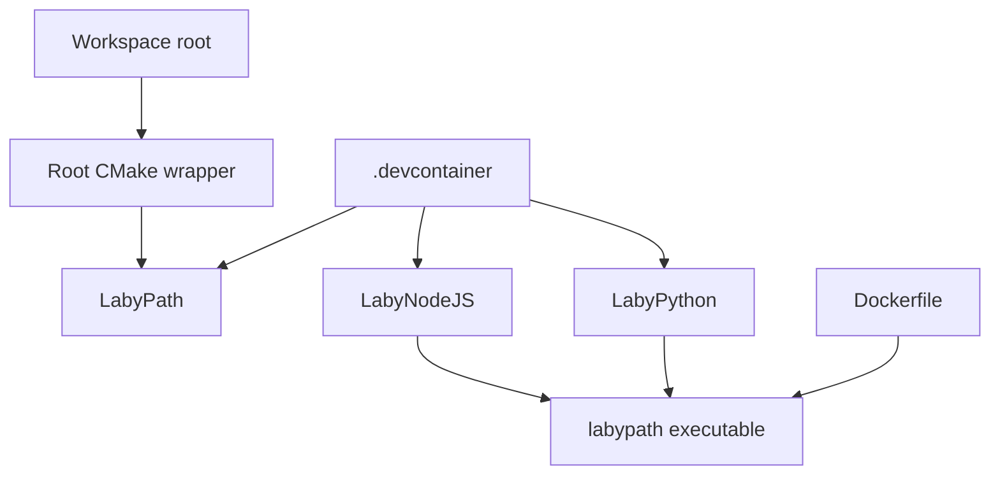
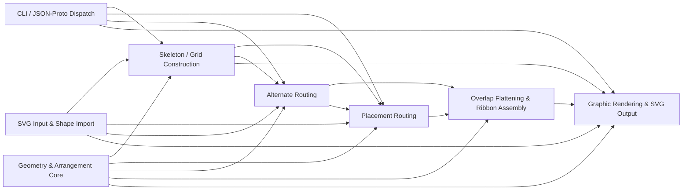

# Repository Architecture

## Top-Level Structure

The repository is a workspace that groups the native engine with two orchestration layers around the same routing engine:

- `LabyPath`: the C++ command-line processor.
- `LabyPython`: the desktop GUI that manages projects and invokes `labypath`.
- `LabyNodeJS`: the TypeScript package that builds stage payloads, invokes `labypath`, and memoizes repeated runs.

The root [CMakeLists.txt](../CMakeLists.txt) is intentionally small. It exists to make the workspace convenient in editors and CI, then delegates to `LabyPath` with `add_subdirectory(LabyPath)`.

## Runtime Responsibilities

### LabyPath

`LabyPath` owns the canonical processing pipeline and the canonical protobuf contract in [../LabyPath/API/AllConfig.proto](../LabyPath/API/AllConfig.proto). The executable reads protobuf-shaped JSON, dispatches the requested processing sections, and produces intermediate or rendered outputs.

### LabyPython

The Python application in [../LabyPython/src/LabyPython/App.py](../LabyPython/src/LabyPython/App.py) is a desktop orchestrator. It creates project files, prepares arguments, searches for the `labypath` binary in common build locations, launches jobs, and manages result files and logs.

### LabyNodeJS

LabyNodeJS is a library-first package in [../LabyNodeJS](../LabyNodeJS). Its main responsibilities are:

- define plain TypeScript stage builders for source, grid, route, and render steps
- serialize protobuf-shaped JSON payloads for the selected stage
- hash the binary, the input SVG, and the normalized payload to derive deterministic cache keys
- persist stage metadata in a single project-local cache manifest
- launch `labypath` as an external process and reuse matching outputs when the cache is valid

The important architectural point is unchanged: the TypeScript layer does not embed the C++ engine. It shells out to the CLI just like the desktop tool does.

## Build Layouts

Two build layouts coexist:

### Workspace Wrapper Build

- source directory: repository root
- build directory: `.cmake/build`
- used by: root VS Code settings and workspace tasks

This path treats the whole repository as the active workspace and keeps generated files out of `LabyPath/`.

### Direct LabyPath Build

- source directory: `LabyPath`
- build directory: `LabyPath/build`
- used by: devcontainer CMake Tools settings

This path is convenient when focusing only on the engine.

The documentation should describe both, because both are present in the checked-in configuration.

## Containers

### Devcontainer

The devcontainer is the full-featured development image. It installs compilers, Python, Qt-related dependencies, and Node.js 24 for LabyNodeJS development.

### Production Docker Image

The root [../Dockerfile](../Dockerfile) is currently aligned with CLI execution, not with the full developer workstation. It builds `labypath`, runs the C++ test suite during the build stage, prepares a lightweight Python environment, and copies the resulting runtime artifacts into the final image.

It does not install:

- Node.js
- the LabyNodeJS package
- the PyQt desktop runtime

That split is deliberate today, even if it may evolve later.

## Dependency Graph

This graph is intentionally about module/runtime dependencies, not about every static library inside `LabyPath`.

## LabyPath Internal Subsystems

The higher-level graph above shows runtime boundaries. Inside `LabyPath`, the main subsystem relationships are tighter than that simplified picture suggests.

The `Alternate --> Placement` edge is a code-reuse edge rather than a pipeline edge: `AlternateRoute` reuses `aniso::Routing::connectMaze()` after it constructs its own trapezoid-derived strips.